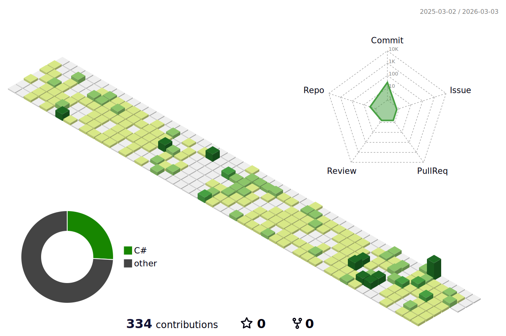

<h1 align="center">Hey 👋, I'm Kashif.</h1>

<p align="left">  </p>

```js
var kashif = {
  occupation: "Game Developer",
  company: "Zen Tech",
  university: "NTU",
  interests: ["Tech", "Games"],
  email: "km4883458@gmail.com",
};
// used var instead of const because I am forever learning and growing :)
```

<h3 align="left">Connect with me:</h3>
<p align="left">
<a href="https://www.linkedin.com/in/kashif-mahmood-4a3121279/" target="blank"></a>
</p>

<p align="center">
	<a href="https://github.com/Q45HIF">
<!-- 		 -->
		
	</a>
</p>


<!-- <picture>
  <source media="(prefers-color-scheme: dark)" srcset="https://raw.githubusercontent.com/Q45HIF/Q45HIF/output/pacman-contribution-graph-dark.svg">
  <source media="(prefers-color-scheme: light)" srcset="https://raw.githubusercontent.com/Q45HIF/Q45HIF/output/pacman-contribution-graph.svg">
  
</picture> -->

<h3 align="left">Languages and Tools:</h3>
<p align="center"> <a href="https://unity.com" target="_blank" rel="noreferrer">  </a> <a href="https://www.w3schools.com/cpp/" target="_blank" rel="noreferrer">  </a> <a href="https://www.w3schools.com/cs/" target="_blank" rel="noreferrer">  </a> <a href="https://www.figma.com/" target="_blank" rel="noreferrer">  </a> <a href="https://firebase.google.com/" target="_blank" rel="noreferrer">  </a> <a href="https://git-scm.com/" target="_blank" rel="noreferrer">  </a>
<a href="https://www.python.org" target="_blank" rel="noreferrer">  </a>
<a href="https://www.blender.org" target="_blank" rel="noreferrer">  </a>
<a href="https://www.photonengine.com" target="_blank" rel="noreferrer">  </a>
<a href="https://aws.amazon.com" target="_blank" rel="noreferrer">  </a>
 </p>
